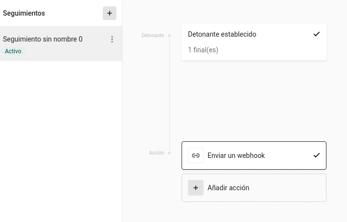
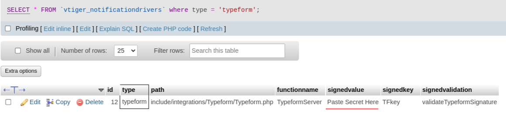

## Typeform Configuration

Configuring the application to read Typeform surveys consists of various steps detailed next:

- Create the survey in Typeform
- Configure a webhook for your survey. In your survey edit screen, click on the configuration cog. Click on Follow ups (Seguimientos). Create a trigger on "Survey finished" and an action of type webhook. For the webhook URL use: `https://your_domain/your_install/notifications.php?type=typeform`. Copy the webhook secret that is created for you.

- Publish the survey
- Open the application database and edit the `vtiger_notifications` table. Find the row for typeform and copy the webhook secret that Typeform gave you into the `signedvalue` column.

- Fill in your survey and the answer should appear in the Survey modules. The process will create
  - Survey record that represents the survey in Typeform
  - Survey Question records for each question
  - Survey Done record representing the fact that a survey was filled in
  - Survey Answers for each response in the survey
- Now you can create workflows associated to the creation event of the different records to have the system act upon them.

## Relating to a client in the application

If you want the Survey Done and Survey Answer records to be related to a record in the application you must add to your survey a hidden field named `cid` with the CRMID of the record. Using Typeform configuration you can add this field to the survey and have it automatically filled in from the URL. So if your Typeform survey has the URL:

`https://form.typeform.com/to/Wk8dk34`

and you add a hidden field named `cid` to that survey you can send this link to your client:

`https://form.typeform.com/to/Wk8dk34?cid={clientCRMID}`

where `clientCRMID` is the CRMID of the record in the application.

------------------------------------------------------------------------

[Next](../10.webdav) | Chapter 10: Integration with Sabre/DAV WebDAV

------------------------------------------------------------------------